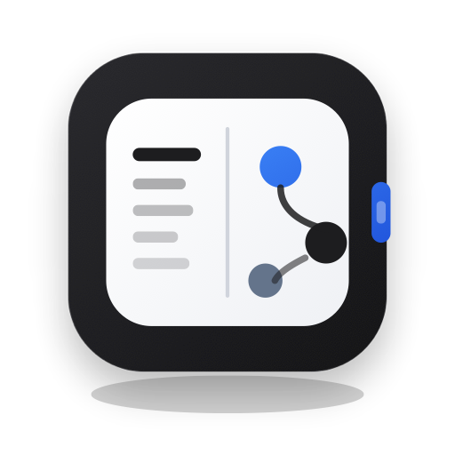
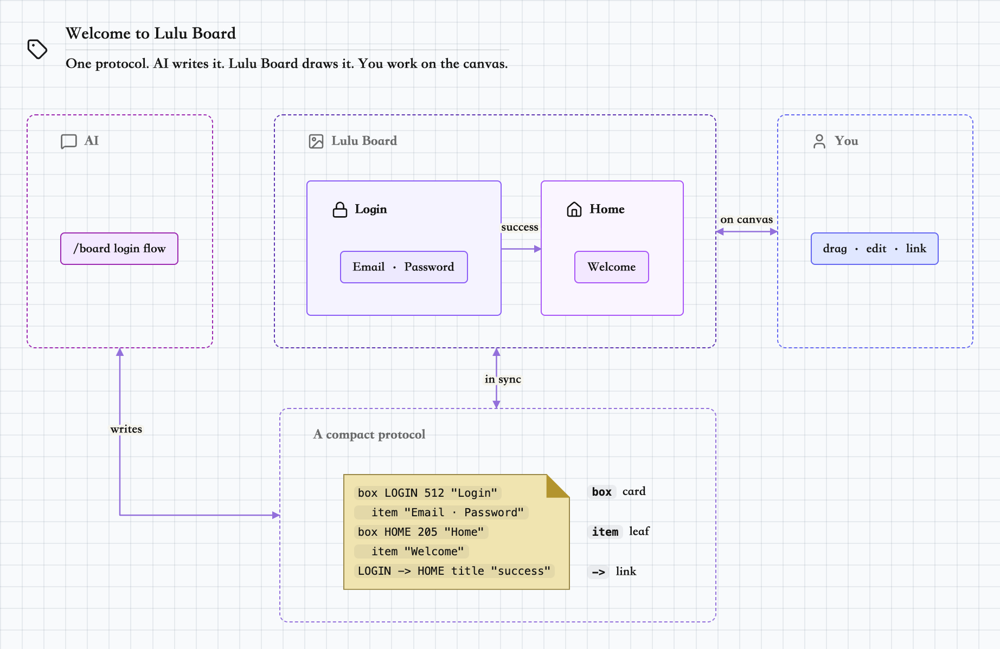
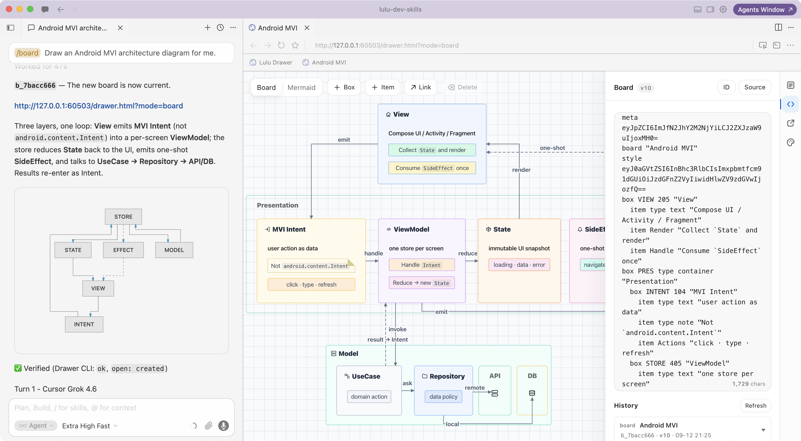
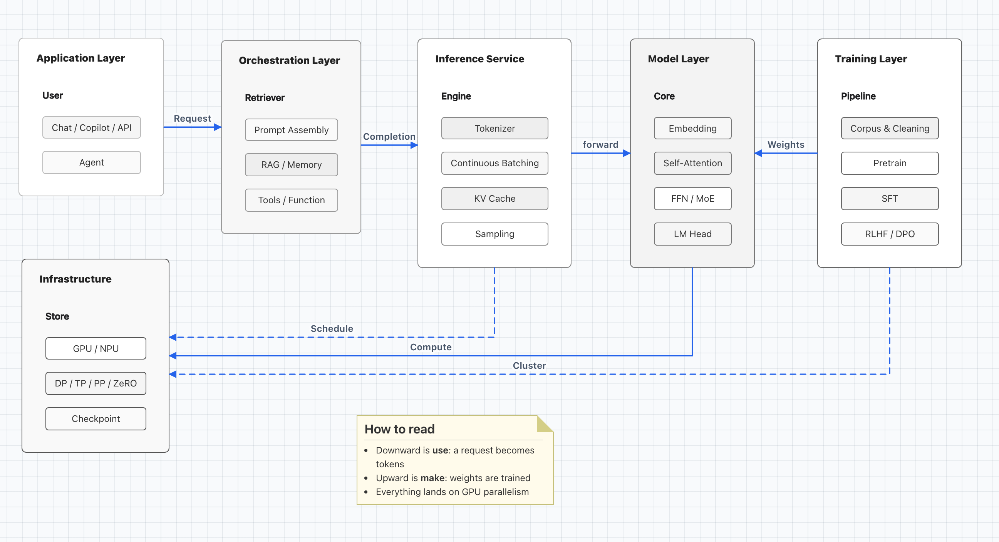

<p align="center">
  
</p>

<h1 align="center">Lulu Board</h1>

<p align="center"><b>One text protocol. AI agent writes it. Lulu Board draws it. You work on the canvas.</b></p>

<p align="center">
  <a href="LICENSE"></a>
</p>

---

One text protocol for boards — the AI agent writes it, Lulu Board draws it, you work on the canvas; both stay in sync. A local loop.

| Mode | Product | Source ID |
|---|---|---|
| Board | **Lulu Board** — structured whiteboard text | BMD (`b_…`) |

## Why

Diagrams go stale when only one side can edit them. Lulu Board keeps one text protocol as the source of truth: the agent writes it, you refine it on the canvas (or in Source), and both stay in sync.

## Quick start

Install the **Lulu Board** Cursor plugin (this public repo; plugin body is [`skill/`](./skill/)), then in chat:

```text
/board
```

The Drawer opens on a built-in template — the onboarding board — so you can see the loop right away:

<p align="center">
  <a href="./examples/board-onboarding/onboarding.bmd">
    
  </a>
</p>

<p align="center"><strong>Onboarding</strong> — AI writes. Lulu Board draws. You work on the canvas.</p>

**Source** (`<>`) → **History** to browse the built-in templates. New files are stored there too.

## Draw from a prompt

Describe what you want after `/board`:

```text
/board Draw an Android MVI architecture diagram for me.
```

The agent authors the source and opens the Drawer. From there you can drag and edit on the canvas, change Source by hand, or ask again — same document, shared with the agent.

<p align="center">
  <a href="./examples/board-android-mvi/android-mvi-architecture.bmd">
    
  </a>
</p>

<p align="center"><strong>Board · Android MVI</strong> — ask in chat, see it in Drawer, edit on canvas or in Source</p>

## Examples

Click a preview to open the source.

### Board

<table>
  <tr>
    <td valign="top" align="center">
      <a href="./examples/board-llm-architecture/llm-architecture.bmd">
        
      </a>
      <p>
        <strong>LLM Architecture</strong><br />
        Agent stack from data through training
      </p>
    </td>
  </tr>
</table>

## Install

Ship **`skill/`** as the Cursor plugin body. Chat entry is `/board`.

```text
.cursor-plugin/marketplace.json   # repo marketplace; source: skill
skill/
  .cursor-plugin/plugin.json      # name: lulu-board; skills: board
  board/     # self-contained /board (SKILL.md, scripts/, templates/)
```

Do not ship `packages/`, `scripts/*-build/`, or `tests/`.

Local test: copy `skill/` to `~/.cursor/plugins/local/lulu-board` (do not symlink out of that folder), then Developer: Reload Window.

## Develop

```text
examples/    # README previews (source + PNG) → packed into skill/board/templates
packages/    # board, drawer-app
scripts/     # build tooling
skill/       # plugin root
tests/
.cache/web/  # generated public viewer (✅ Verified: scripts/web-build/build.mjs)
```

From the repo root:

```bash
node scripts/web-build/build.mjs
# or pack examples alone:
node scripts/examples-templates-build/build.mjs
```

## License

- Project: [MIT](./LICENSE)
- Vendored: [THIRD_PARTY.md](./THIRD_PARTY.md)
