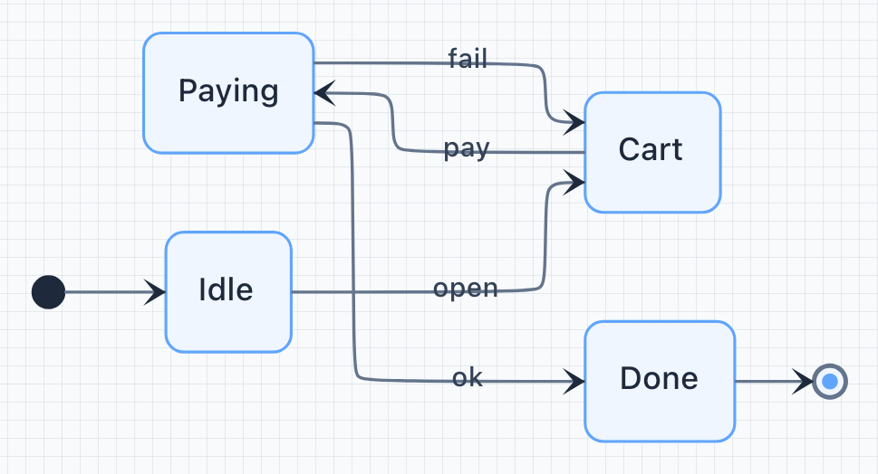
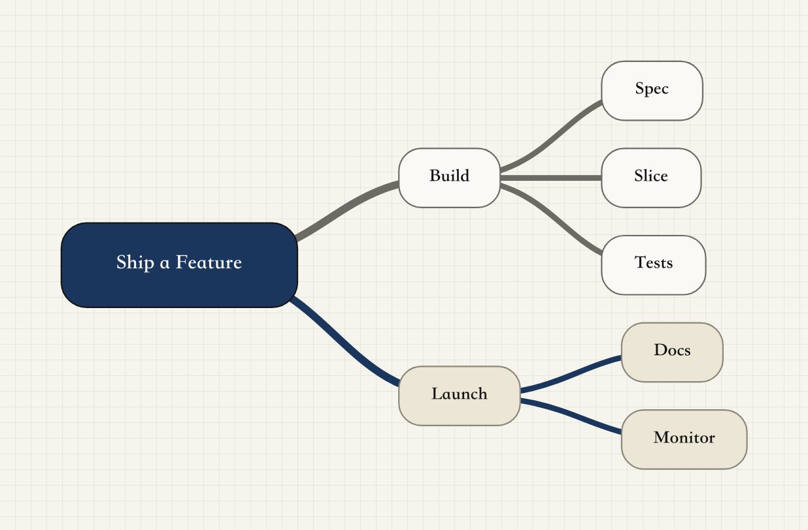

# Lulu Drawer

**Lulu Board** and **Lulu Mermaid** in a local Drawer loop — write a diagram, see it live, edit or ask, export.

| Mode | Product | ID | Skill |
|---|---|---|---|
| Board | Lulu Board | BMD ID (`b_…`) | `skill/board/` |
| Mermaid | Lulu Mermaid | MMD ID (`m_…`) | `skill/mermaid/` |

## How to use

In Cursor (or your agent), start with:

```text
/board
```

The Drawer opens with built-in samples in **History**. Open History and pick **Android MVI** — that board is the walkthrough: edit boxes on the canvas, ask the agent to revise, keep iterating.

<p align="center">
  <a href="./examples/board-android-mvi/android-mvi-architecture.bmd">
    
  </a>
</p>

<p align="center"><strong>Board · Android MVI</strong> — Intent · State · SideEffect</p>

Mermaid works the same way with `/mermaid`, then History.

## Showcase

More samples under [`examples/`](./examples/). Click a preview to open the source.

### Board

Stacked full-width previews (one per row).

<table>
  <tr>
    <td valign="top" align="center">
      <a href="./examples/board-onboarding/onboarding.bmd">
        
      </a>
      <p>
        <strong>Board · Onboarding</strong><br />
        Welcome · Write · See · Edit · Ask — product story
      </p>
    </td>
  </tr>
  <tr>
    <td valign="top" align="center">
      <a href="./examples/board-llm-architecture/llm-architecture.bmd">
        
      </a>
      <p>
        <strong>Board · LLM Architecture</strong><br />
        Agent stack from data through training
      </p>
    </td>
  </tr>
</table>

### Mermaid

正在完善中。渲染依赖开源项目 [mermaid](https://github.com/mermaid-js/mermaid) 与 [elkjs](https://github.com/kieler/elkjs)（经 `@mermaid-js/layout-elk`）。

Two per row.

<table>
  <tr>
    <td width="50%" valign="top" align="center">
      <a href="./examples/mermaid-state/checkout.mmd">
        
      </a>
      <p>
        <strong>Mermaid · State</strong><br />
        Compact checkout UI state machine
      </p>
    </td>
    <td width="50%" valign="top" align="center">
      <a href="./examples/mermaid-mindmap/ship-a-feature.mmd">
        
      </a>
      <p>
        <strong>Mermaid · Mindmap</strong><br />
        Ship a feature — Build / Launch (Logic layout)
      </p>
    </td>
  </tr>
</table>

## Install the skill (not this whole repo)

Install / publish **only** [`skill/`](./skill/).

```text
skill/
  SKILL.md
  board/ mermaid/ drawer/
  board/templates/demo.bmd   # AI-facing sample (not seeded into History)
  assets/                    # viewer + assets/templates/{board,mermaid} for History
  scripts/                   # runtime CLI
```

Do **not** install the monorepo root as a skill (`packages/`, `scripts/*-build/`, and `tests/` are for development).

## Develop in this monorepo

```text
examples/           # README showcase (source + PNG); pack into skill/assets/templates
packages/           # sources (board, drawer-app, mermaid-*)
scripts/*-build/    # build tooling (not shipped in skill/)
skill/assets/       # build output (tracked for skill install)
tests/
```

Build (from repo root):

```bash
node scripts/drawer-app-build/build.mjs
node scripts/board-build/build.mjs
node scripts/mermaid-ext-build/build.mjs
# board-build / mermaid-ext-build also pack examples → skill/assets/templates/{board,mermaid}
# or pack alone:
node scripts/examples-templates-build/build.mjs
```

## License

- Project: [MIT](./LICENSE)
- Vendored Mermaid: [THIRD_PARTY.md](./THIRD_PARTY.md)
