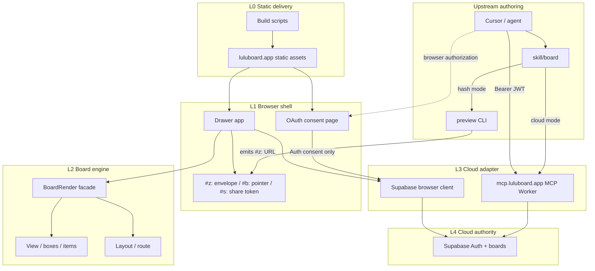

# Board Architecture Layer Constraints

This document is Lulu Board's target technical architecture. When code diverges, change code toward this document; do not weaken this document to preserve an accidental dependency.

Technical call direction and authority only: no business behavior, reverse calls, or layer skips.

---

## Layers

| Layer | Responsibility | Boundary |
| --- | --- | --- |
| **L-up — Authoring** | Agents author BMD through the skill. Hash mode emits an unsigned public link; cloud mode reads and writes the owner's cloud row through L3. | Imports nothing from the browser engine, Drawer, cloud, build, or generated output. Credentials belong to the MCP client, never to the skill. |
| **L0 — Delivery** | Builds and serves the static site, including the consent page. | Static delivery only: no document, identity, session, mutation, or service-key authority. The static site and the MCP Worker are separate deployments. |
| **L1 — Browser shell** | Drawer owns DOM, chrome, URL transport, file I/O, and local UI preferences. The consent page is a standalone surface for MCP authorization. | Drawer is the only caller of L2. Drawer and the consent page are the only browser callers of L3; the consent page reaches Auth only. Neither parses BMD nor adds a second serializer. |
| **L2 — Board engine** | `BoardRender` is the single public facade for BMD parse, validate, mutate, serialize, layout, and render. | No dependency on Drawer, DOM, storage, export, Auth, cloud, HTTP, or hosting. |
| **L2 internals** | Views, boxes, items, themes, icons, layout, and routing implement the engine. | Dependencies flow toward `BoardRender` only. |
| **L3 — Cloud adapter** | The browser client and the MCP Worker adapt L1 and L-up intent to the cloud authority under the user's own identity. | Only L3 calls Supabase. Adapters hold no service key and own no document semantics; BMD is opaque to them. The MCP Worker exposes owner-scoped board read/write only — no share, listing, or extra write path. |
| **L4 — Cloud authority** | Supabase owns identity, authenticated scope, the signed board row, and its version. | Calls no other layer. |
| **Transport** | `#z:` is an unsigned content envelope; `#b:` an owned-row pointer; `#s:` a share pointer. | `#z:` never writes cloud implicitly. Pointers are neither content nor authorization. |

---

## Cross-layer constraints

1. The BMD body carries content only, never identity. Legacy identity envelopes are stripped at ingress and never regenerated.
2. Document authority lives in the URL hash or the cloud row; local history has none.
3. Browser storage keeps chrome state only — never BMD, identity, or revision authority.
4. Clients compare against a version; only L4 advances it.
5. Generated output is never a source input or plugin dependency.
6. Tests may cross layers without creating production dependencies.
