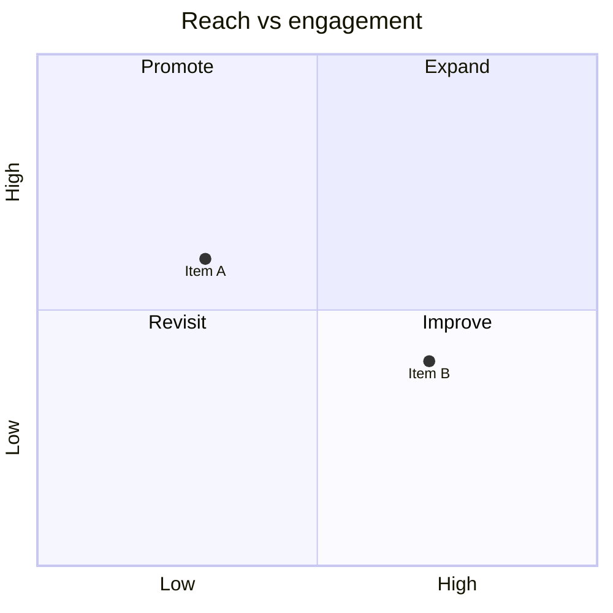

# quadrant

Keyword: `quadrantChart`.
Invariant: 2×2 with points in `[x, y]` from 0 to 1.

## minimal

```mermaid
quadrantChart
  title Reach vs engagement
  x-axis Low --> High
  y-axis Low --> High
  quadrant-1 Expand
  quadrant-2 Promote
  quadrant-3 Revisit
  quadrant-4 Improve
  Item A: [0.3, 0.6]
  Item B: [0.7, 0.4]
```
