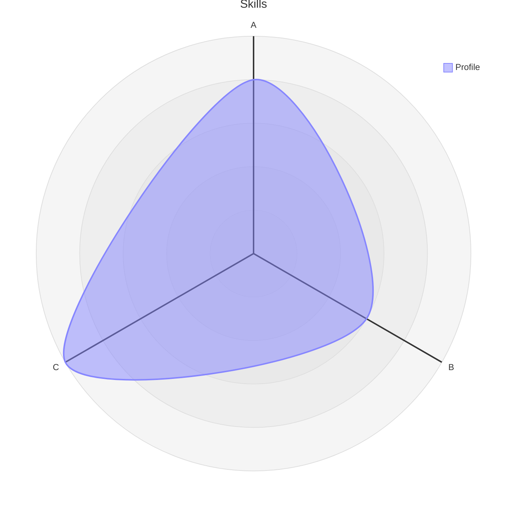

# radar

Keyword: `radar-beta`.
Invariant: named axes and one or more curves of the same length.

## minimal

```mermaid
radar-beta
  title Skills
  axis a["A"], b["B"], c["C"]
  curve p["Profile"]{4, 3, 5}
```
