# c4

Keywords: `C4Context` / `C4Container` / `C4Component` / `C4Dynamic` / `C4Deployment`.
Invariant: one view level per diagram. Arrows are relationships, not next step.

# C4 view levels

Three levels in v1. Level is the primary discriminator.
Within a level, pick **minimal** (default) or **rich**.

## How to choose a sample

1. Choose Context / Container / Component by what must be visible.
2. Use **minimal** for a quick boundary sketch.
3. Use **rich** when externals, `title`, and verb-phrase `Rel` labels matter.

## Disambiguation

| Need to show… | Level |
|---------------|-------|
| People and systems around *our* system | Context |
| Apps, DBs, queues inside one system | Container |
| Modules inside one container | Component |
| Classes / functions inside one component | Code (v1: defer) |

## Shared rules

1. Arrows are relationships (uses, calls, reads/writes), not “next step”.
2. Prefer Mermaid C4 dialect first; flowchart approximation only as fallback.
3. **rich** samples should keep: `title`, external systems when relevant,
   and `Rel(..., "动词短语")`.

---

## 1. Context

### minimal

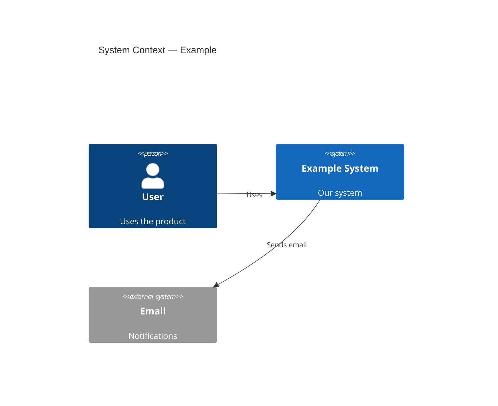

### rich

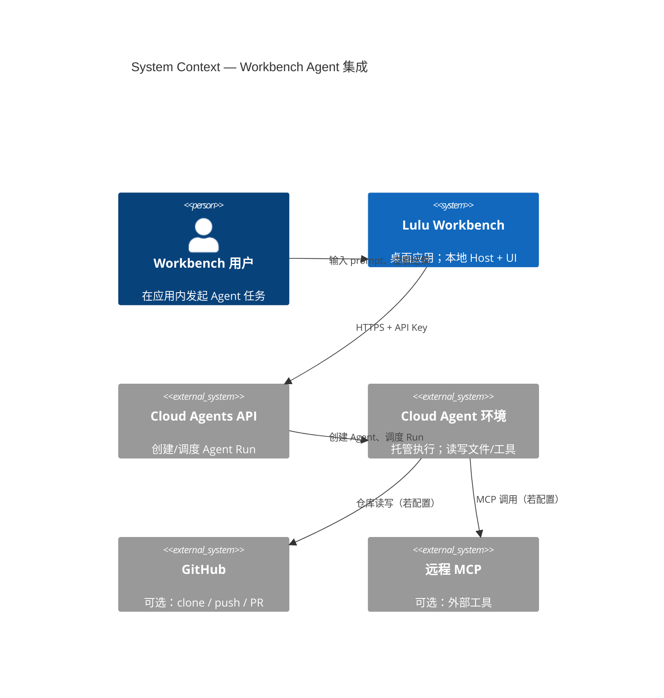

**Flowchart approximation (if C4 unsupported):**

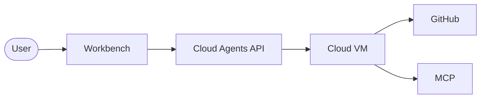

---

## 2. Container

### minimal

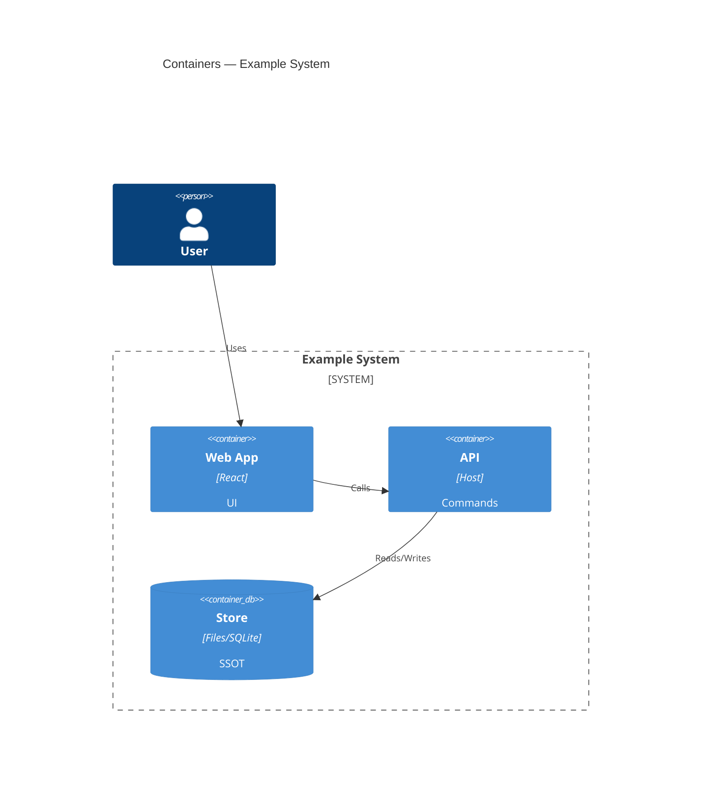

### rich

Use multiple boundaries when a side path must stay visually isolated.

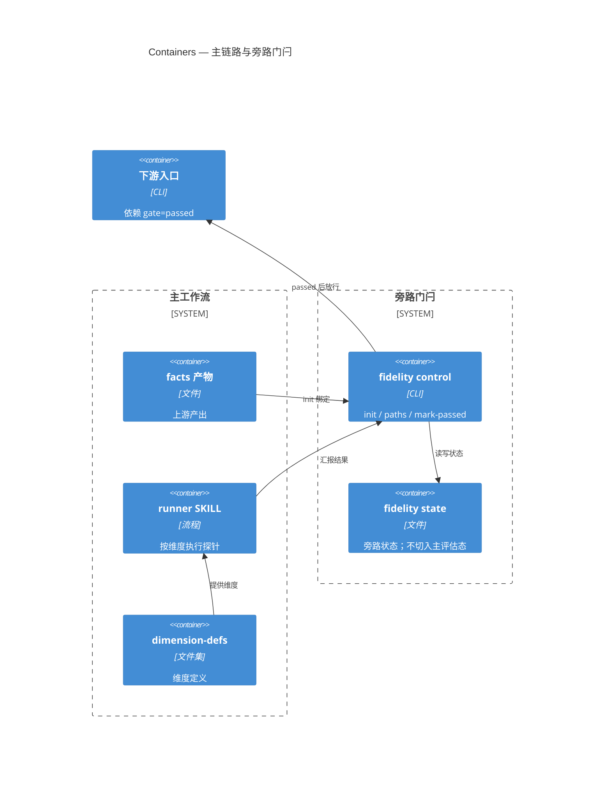

**Flowchart approximation:**

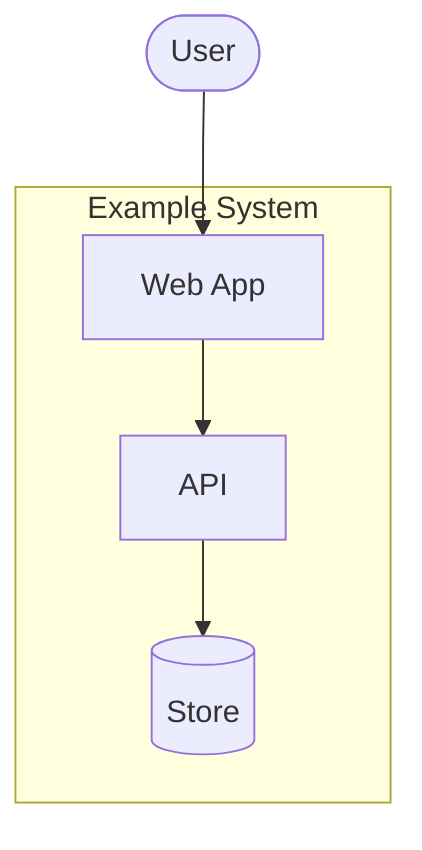

---

## 3. Component

### minimal

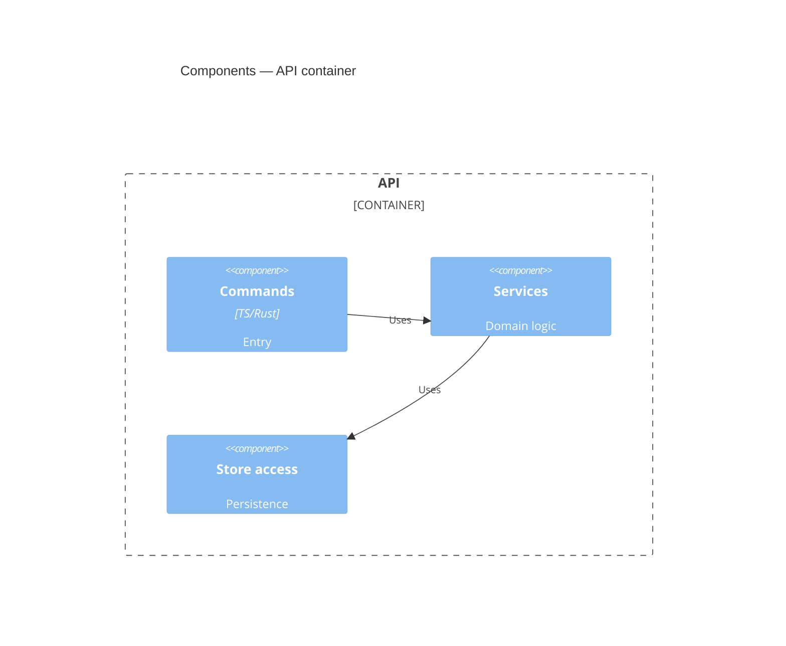

### rich

Fill technology + responsibility; show externals that inject or coexist.

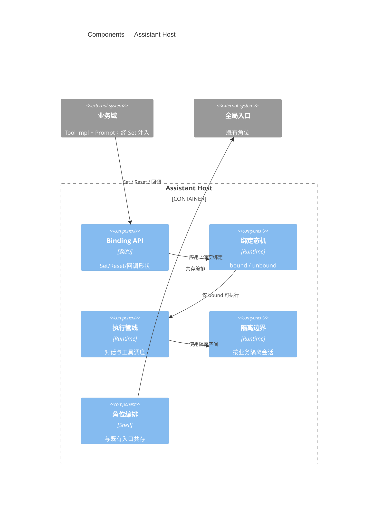

**Flowchart approximation:**

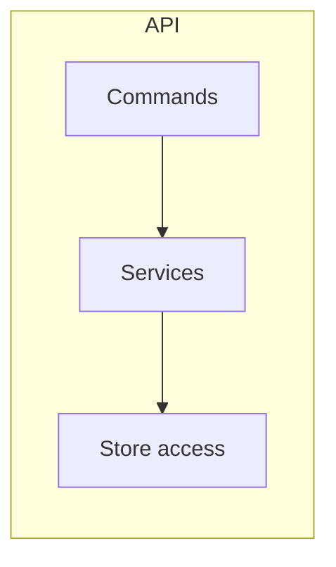

---

## Anti-patterns

1. Mixing Context people with Component-level modules in one diagram.
2. Using decision diamonds or UI event labels — that belongs to `flowchart`.
3. Drawing every class/file at Component level (Code; defer in v1).
4. Inventing a fourth ad-hoc level name when Context/Container/Component fit.

---

## 4. Dynamic (minimal)

Keyword: `C4Dynamic`. Numbered interactions over time.

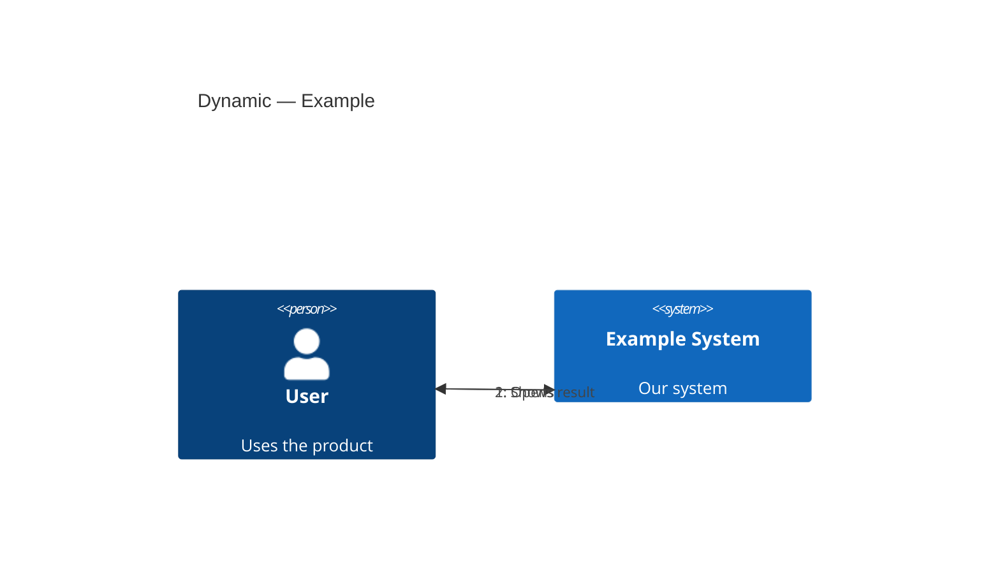

---

## 5. Deployment (minimal)

Keyword: `C4Deployment`. Where containers run.

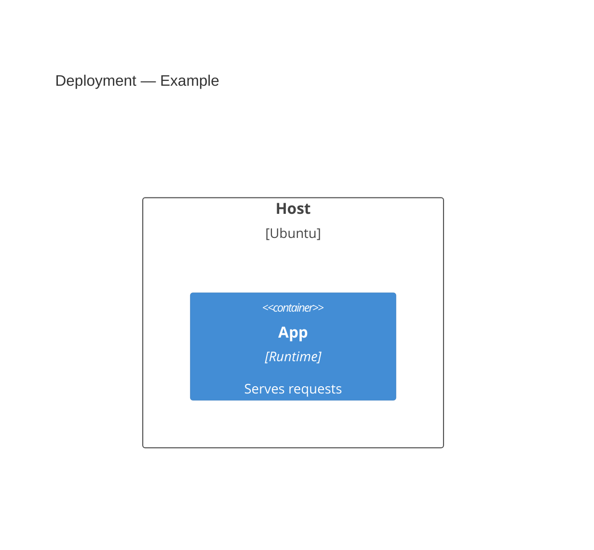
