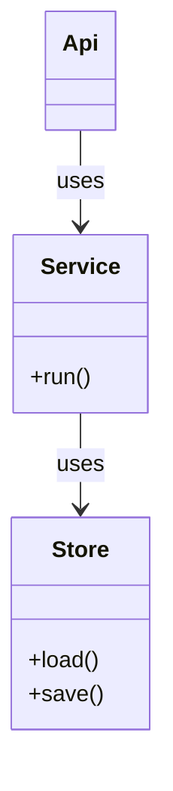
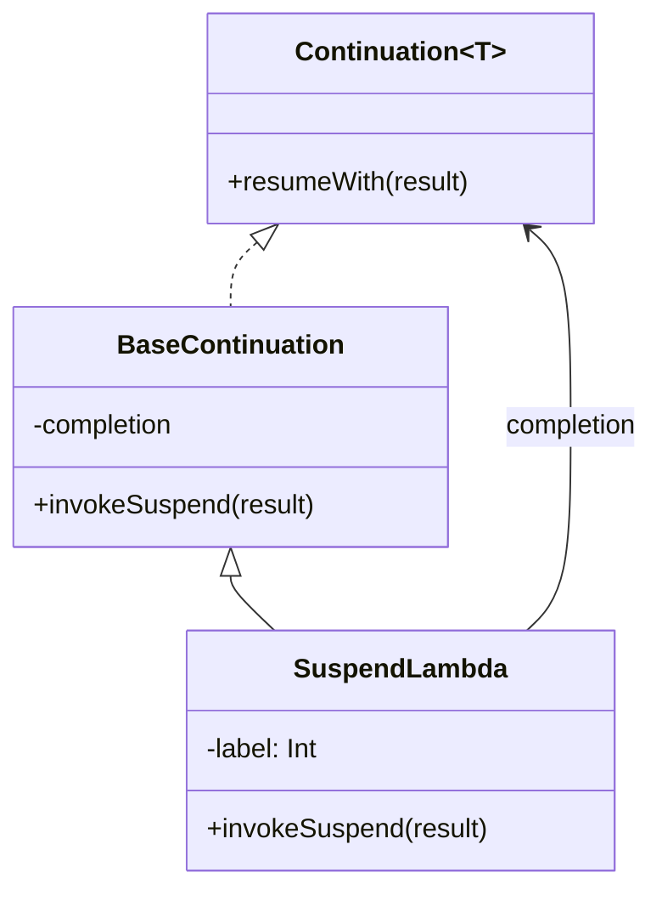

# class

Keyword: `classDiagram` (also `classDiagram-v2`).
Invariant: types and structural relations. Not runtime steps.

## minimal

```mermaid
classDiagram
  class Service {
    +run()
  }
  class Store {
    +load()
    +save()
  }
  Service --> Store : uses
  class Api
  Api --> Service : uses
```

## rich

```mermaid
classDiagram
  class Continuation~T~ {
    +resumeWith(result)
  }
  class BaseContinuation {
    -completion
    +invokeSuspend(result)
  }
  class SuspendLambda {
    -label: Int
    +invokeSuspend(result)
  }
  Continuation <|.. BaseContinuation
  BaseContinuation <|-- SuspendLambda
  SuspendLambda --> Continuation : completion
```
