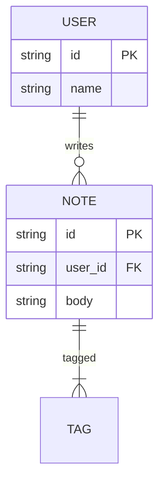
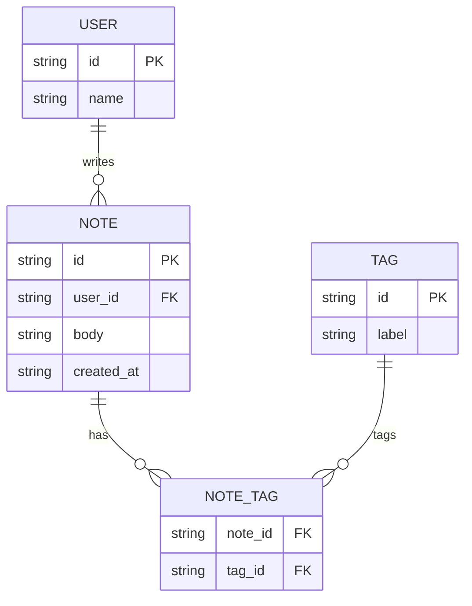

# er

Keyword: `erDiagram`.
Invariant: entities and cardinalities. Not class methods.

## minimal

```mermaid
erDiagram
  USER ||--o{ NOTE : writes
  NOTE ||--|{ TAG : tagged
  USER {
    string id PK
    string name
  }
  NOTE {
    string id PK
    string user_id FK
    string body
  }
```

## rich

```mermaid
erDiagram
  USER ||--o{ NOTE : writes
  NOTE ||--o{ NOTE_TAG : has
  TAG ||--o{ NOTE_TAG : tags
  USER {
    string id PK
    string name
  }
  NOTE {
    string id PK
    string user_id FK
    string body
    string created_at
  }
  TAG {
    string id PK
    string label
  }
  NOTE_TAG {
    string note_id FK
    string tag_id FK
  }
```
