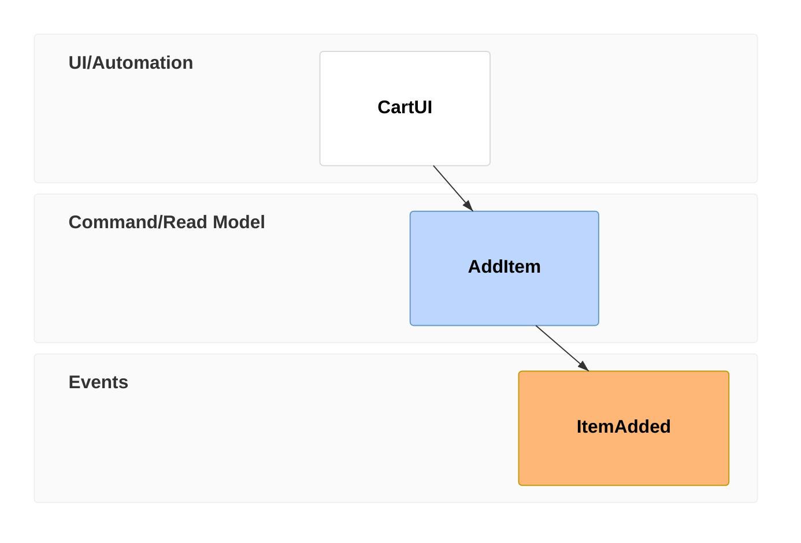

# eventmodeling

Keyword: `eventmodeling`.
Invariant: numbered time frames of UI, commands, and events.

Drawer renders through Pele. Properties edit Title. Source edits the body.

## minimal

```mermaid
eventmodeling
tf 01 ui CartUI
tf 02 cmd AddItem
tf 03 evt ItemAdded
```
