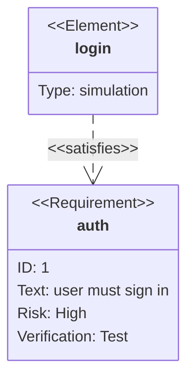

# requirement

Keyword: `requirementDiagram` (also `requirement`).
Invariant: requirements, elements, and satisfy/verify links.

## minimal

```mermaid
requirementDiagram
  requirement auth {
    id: 1
    text: user must sign in
    risk: high
    verifymethod: test
  }
  element login {
    type: simulation
  }
  login - satisfies -> auth
```
