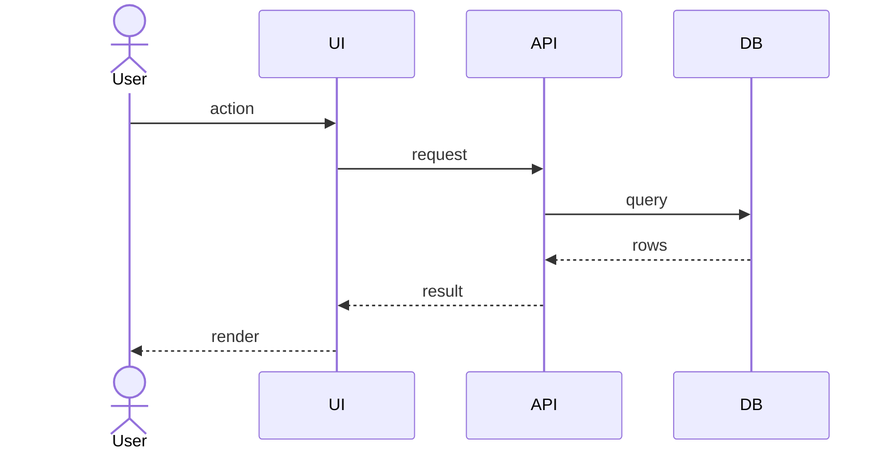
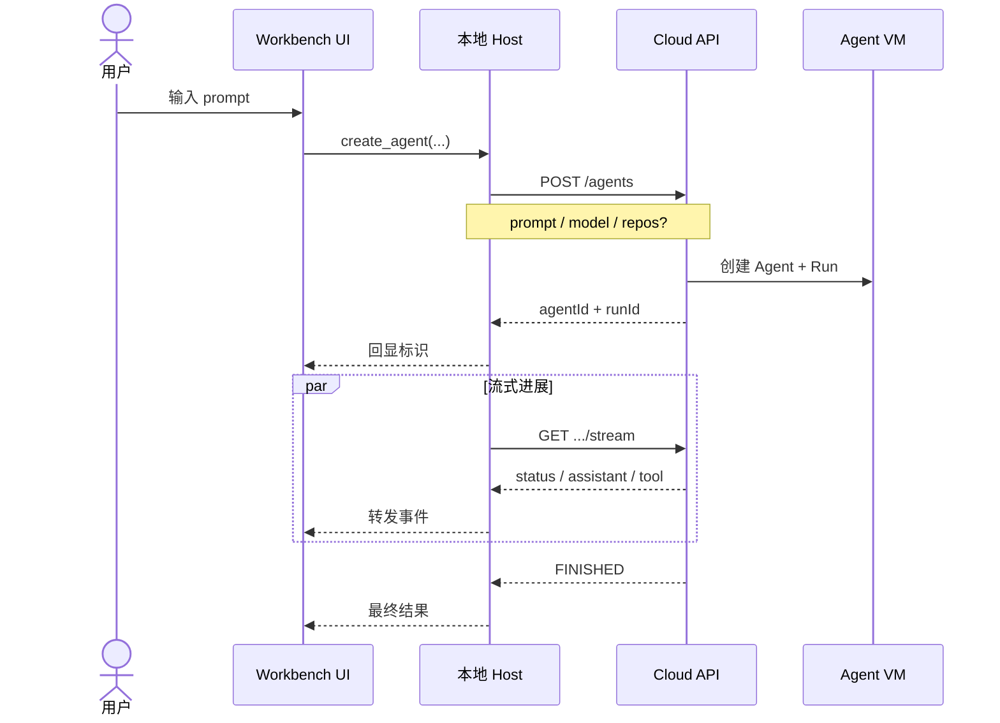

# sequence

Keyword: `sequenceDiagram`.
Invariant: messages over time between participants. Not control-flow diamonds.

## minimal

```mermaid
sequenceDiagram
  actor User
  participant UI
  participant API
  participant DB
  User->>UI: action
  UI->>API: request
  API->>DB: query
  DB-->>API: rows
  API-->>UI: result
  UI-->>User: render
```

## rich

Use `as` aliases, `Note over`, and optional `par`.

```mermaid
sequenceDiagram
  actor U as 用户
  participant UI as Workbench UI
  participant Host as 本地 Host
  participant API as Cloud API
  participant VM as Agent VM
  U->>UI: 输入 prompt
  UI->>Host: create_agent(...)
  Host->>API: POST /agents
  Note over Host,API: prompt / model / repos?
  API->>VM: 创建 Agent + Run
  API-->>Host: agentId + runId
  Host-->>UI: 回显标识
  par 流式进展
    Host->>API: GET .../stream
    API-->>Host: status / assistant / tool
    Host-->>UI: 转发事件
  end
  API-->>Host: FINISHED
  Host-->>UI: 最终结果
```
