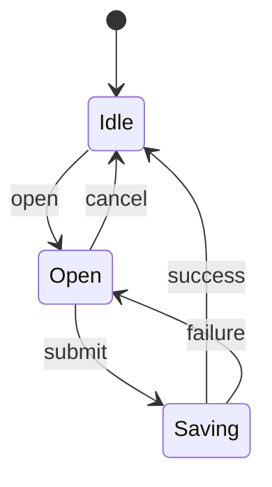
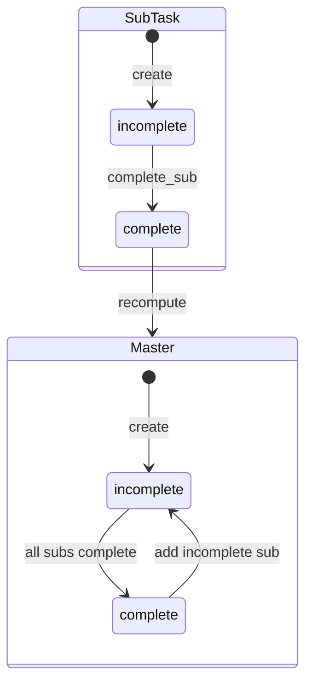

# state

Keyword: `stateDiagram-v2` (prefer over `stateDiagram`).
Invariant: states and labeled transitions.

## minimal

## rich

Distinct ids (`S_*` / `M_*`) keep cross-composite edges drawable; quoted labels
keep visible text short. Shared ids make `complete --> Master` a child→parent
path that Mermaid collapses to a point.
