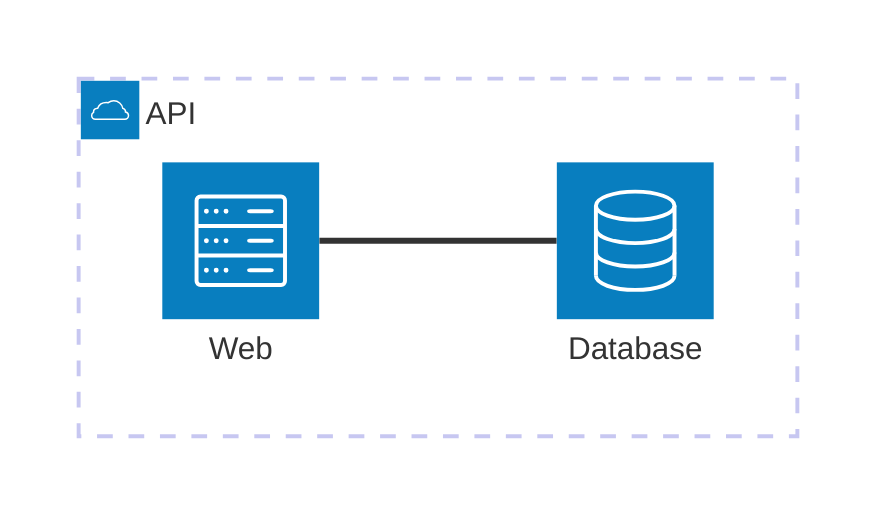

# architecture

Keyword: `architecture-beta` (detector also accepts `architecture`).
Invariant: groups, services, and side-to-side edges (`L`/`R`/`T`/`B`).
Titles in `[…]` are letters and spaces only — no `.` or `-` (`mermaid.ts` / `diagram-api` fail parse).

## minimal

