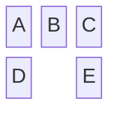

# block

Keyword: `block` (also `block-beta`). Author `block`.
Invariant: tiled blocks and columns. Not flowchart edge semantics.

## minimal

```mermaid
block-beta
columns 3
  A B C
  D space E
```
