# flowchart

Keyword: `flowchart` (also `graph`, `flowchart-elk`).
Invariant: one edge meaning per diagram. Diamonds only in category 1.

# Flowchart categories

Six application categories. **Edge meaning** is the primary discriminator.
Within a category, pick **one** sample: `minimal` (default) or `rich` (more
granularity / annotations). Do not mix samples' extra conventions casually.

## How to choose a sample

1. Choose the category by arrow meaning.
2. Use **minimal** unless the subject needs layers, multi-branch decisions,
   event labels, soft constraints, or notes.
3. Use **rich** when history-style density helps (named subgraphs, labeled
   edges, dashed soft links, multi-way diamonds).

## Disambiguation

| If arrows mean… | Category |
|-----------------|----------|
| Next step / yes-no (or multi-way) branch | 1 Decision control-flow |
| UI/system event (click, open, save) | 2 UI event flow |
| Bytes/content land somewhere | 3 Data / product pipeline |
| Module depends on module | 4 Module / layer dependency |
| Work item unlocks work item | 5 Milestone / task DAG |
| Function/file calls next in a run | 6 Partitioned call chain |

---

## 1. Decision control-flow

**Edge:** next control step / branch outcome.  
**Nodes:** process `[动作]`, decision `{条件?}`, terminals `([开始/结束])`.

### minimal

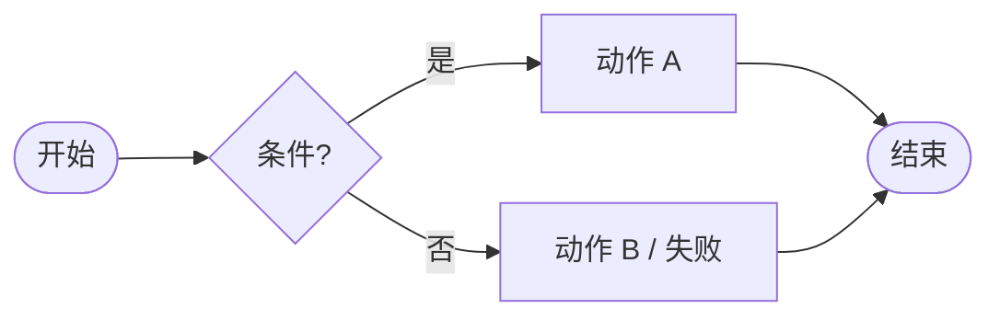

### rich

Multi-way diamonds and parallel fan-in are allowed; still one control-flow
edge meaning.

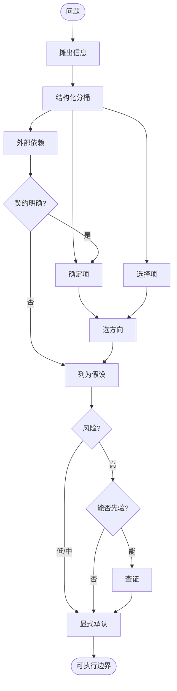

---

## 2. UI event flow

**Edge:** user/system event.  
**Nodes:** UI / Host / Store subgraphs. Diamonds only if a real UI branch matters.

### minimal

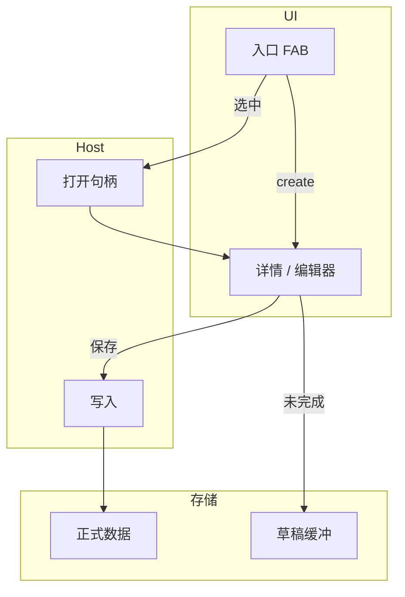

### rich

Prefer **labeled events** on edges; use dashed edges for soft constraints
(mutex, dismiss), not for data dependency.

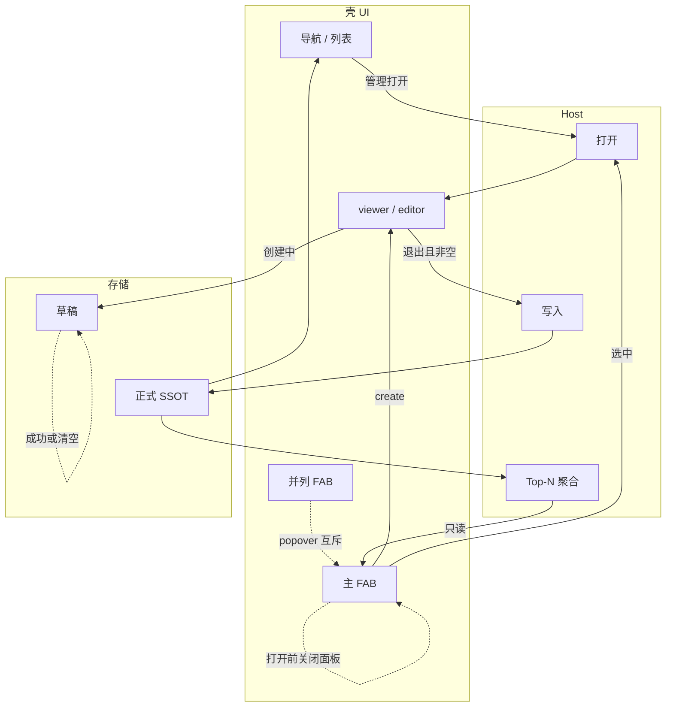

---

## 3. Data / product pipeline

**Edge:** flows into / written to.  
**Not** a click-through wizard (that is 1 or 2).

### minimal

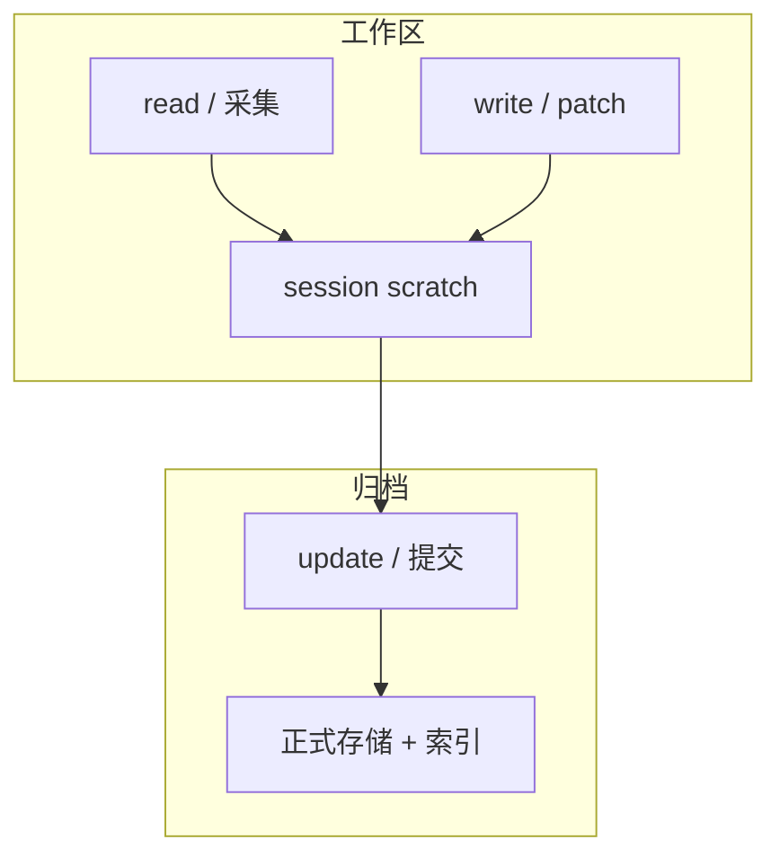

### rich

Separate **intent UI**, **agent tools**, and **durable store**; dashed edge
for optional bind/archive path.

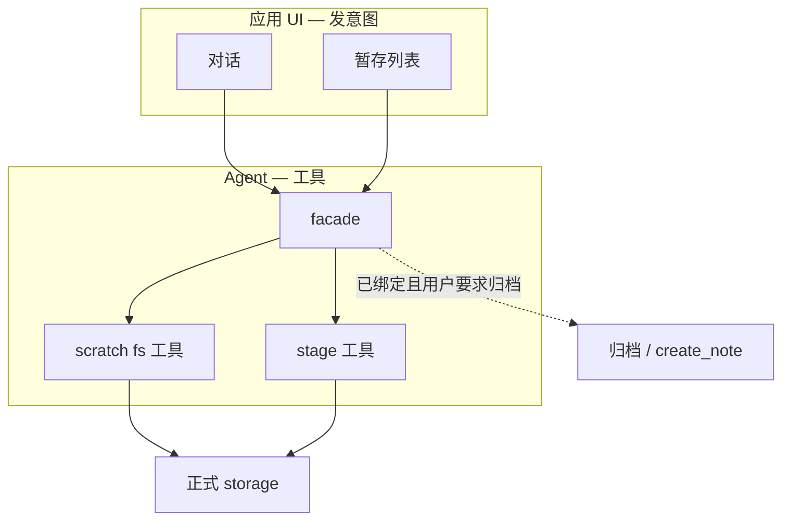

---

## 4. Module / layer dependency

**Edge:** depends on (depender → dependency).  
**Layout:** layers as subgraphs; no time narrative.

### minimal

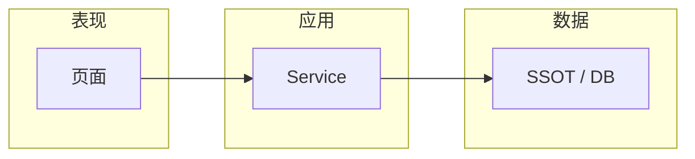

### rich

Name layers `L0…Ln` (or 表现/应用/领域/基础设施); edges stay **depends on**,
never “next step”.

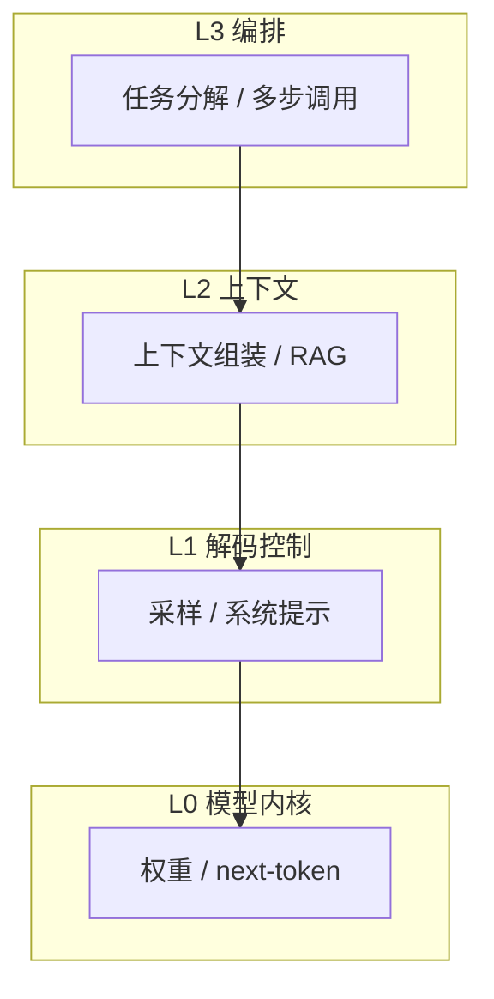

---

## 5. Milestone / task DAG

**Edge:** prerequisite / unlock.  
**Nodes:** milestones/features — not runtime modules (use 4).

### minimal

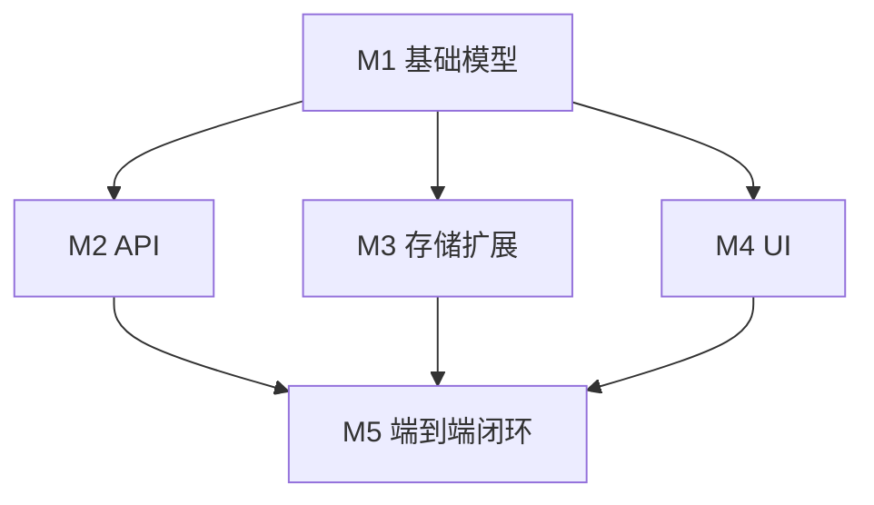

### rich

Same edge meaning; show parallel unlocks and a clear integration milestone.

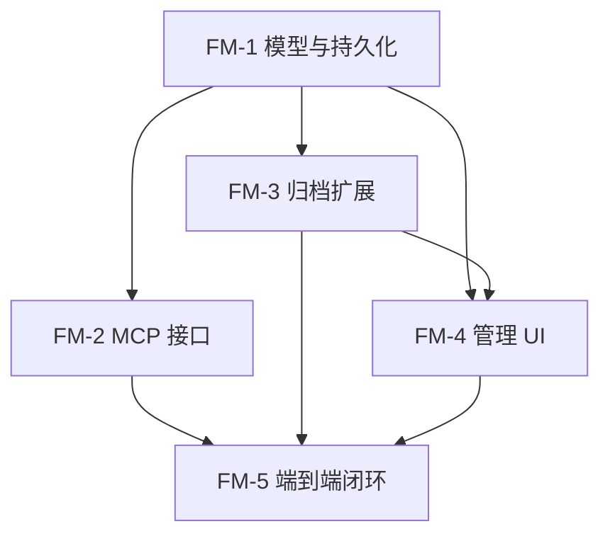

---

## 6. Partitioned call chain

**Edge:** invokes / next processing step in a run.  
**Subgraph:** real file/module boundary when known.

### minimal

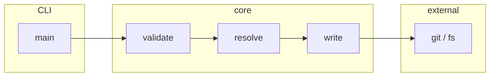

### rich

Keep subgraphs aligned to modules; linearize the happy path inside a run.

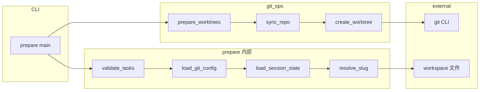

---

## Anti-patterns

1. Mixing dependency arrows with "then do X" in one diagram.
2. Using `{决策}` outside category 1.
3. Turning a layering diagram into a fake timeline story.
4. Inventing a seventh ad-hoc style when one of the six fits.
5. Picking **rich** and then stripping edge labels until meaning is ambiguous.
