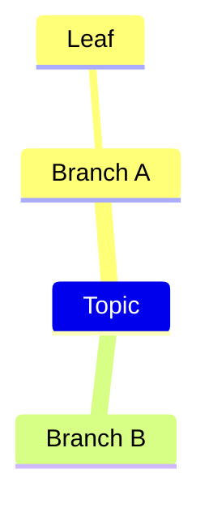

# mindmap

Keyword: `mindmap`.
Invariant: one root, indented branches. Not a flowchart.

Drawer draws every node as the same soft pill; Topic (root) is larger.
Shape markers like `((Topic))` are accepted on parse but not used for rendering,
and edits serialize plain labels only.

## minimal

