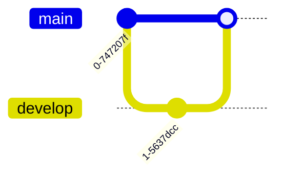

# gitGraph

Keyword: `gitGraph`.
Invariant: commits, branches, and merges.

## minimal

```mermaid
gitGraph
  commit
  branch develop
  checkout develop
  commit
  checkout main
  merge develop
```
